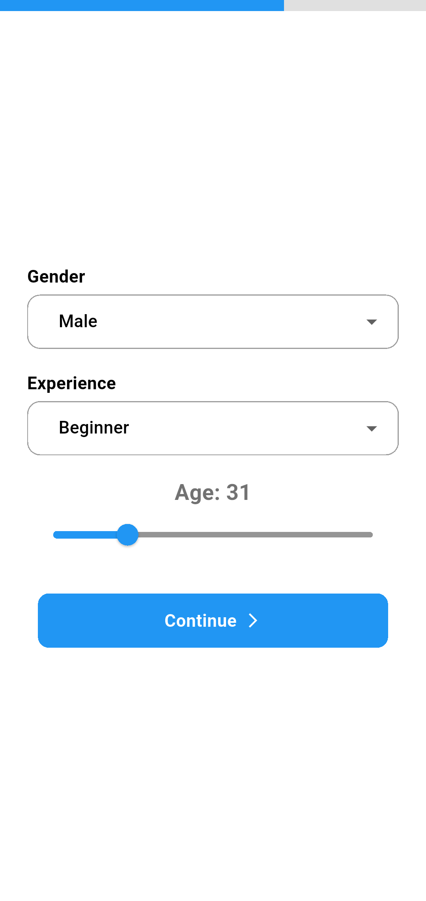

# Smart Parking Spot Finder 🚗

A Flutter-based mobile application that uses AI-powered computer vision to find the best parking spot for drivers. The app analyzes parking lots through YOLO object detection and recommends optimal parking spots based on multiple factors including driver profile and preferences.

## 📱 Demo

### App Demo Video
[](Assets/Videos/demo.mp4)

> *Click above to watch the full application demonstration*

### Screenshots

<div align="center">

| Loading Screen | Upload Image | Set Coordinates |
|-------------|----------------|--------------|
|  |  |  |

| User Details 1 | User Details 2 | Result  |
|-------------|----------------|--------------|
|  |  |  |

</div>

## 🚀 Features

- **AI-Powered Spot Detection**: Uses YOLO model for real-time parking spot identification
- **Intelligent Recommendations**: Considers multiple factors for optimal spot selection
- **Cross-Platform**: Built with Flutter for both iOS and Android
- **Real-time Processing**: Fast API backend for quick response times
- **User-Centric Design**: Personalized recommendations based on driver profile

## 🏗️ Architecture

### Frontend (Flutter)
- Cross-platform mobile application
- Camera integration for image capture
- Real-time communication with backend API
- User-friendly interface for parking spot visualization

### Backend (FastAPI)
- High-performance Python web framework
- YOLO model integration for image processing
- RESTful API endpoints
- Intelligent algorithm for spot recommendation

## 🧠 Smart Recommendation Algorithm

The application considers multiple factors to recommend the best parking spot:

- **🚪 Distance from Entrance/Exit**: Prioritizes spots closer to building entrances and exits
- **👤 Driver Experience**: Adjusts recommendations based on driving experience level
- **📅 Age**: Considers age-related preferences for accessibility and convenience
- **📏 Space Availability**: Evaluates parking space dimensions and accessibility
- **👥 Gender**: Incorporates safety and preference considerations

### Algorithm Flow

<div align="center">


*Flow diagram showing how the recommendation system works*

</div>

## 🛠️ Tech Stack

### Mobile App
- **Framework**: Flutter
- **Language**: Dart
- **HTTP**: HTTP package for API communication
- **go_router**: Handle Navigation
- **image_picker**: To Pick File from mobile image library
- **provider**: State mangement
- **dropdown_button2**: Custom drop down list
- **image**: conversion of bytes to Image File 

### Backend
- **Framework**: FastAPI
- **Language**: Python 3.8+
- **AI/ML**: YOLO (You Only Look Once) object detection
- **API Documentation**: Automatic Swagger/OpenAPI docs

### AI Model
- **Object Detection**: YOLOv8n (Nano - Lightweight model)
- **Custom Training**: Trained on 4,000+ parking lot top-view images
- **Image Processing**: Real-time parking spot detection from aerial/top perspective

## 📋 Prerequisites

### For Mobile App
- Flutter SDK (3.0+)
- Dart SDK
- Android Studio / Xcode
- Android SDK / iOS SDK

### For Backend
- Python 3.8 or higher
- pip package manager
- Virtual environment (recommended)

## 🚀 Installation & Setup

### Backend Setup

1. **Clone the repository**
```bash
git clone <https://github.com/kailash9712t/SmartParkingApp>
```

2. **Navigate to backend directory**
```bash
cd backend
```

3. **Create virtual environment**
```bash
python -m venv venv
source venv/bin/activate  # On Windows: venv\Scripts\activate
```

4. **Install dependencies**
```bash
pip install -r requirements.txt
```

5. **Start the FastAPI server**
```bash
uvicorn main:app --reload --host 0.0.0.0 --port 8000
```

### Mobile App Setup

1. **Navigate to Flutter app directory**
```bash
cd frontend
```

2. **Get Flutter dependencies**
```bash
flutter pub get
```

3. **Run the application**
```bash
# For Android
flutter run

# For iOS
flutter run -d ios
```

### Key Endpoints

- `POST /upload_image` - Submit image and data for parking spot analysis

## 📱 Usage

1. **Open the mobile app**
2. **Create or update your driver profile** with:
   - Experience level (Beginner/Intermediate/Expert)
   - Age
   - Gender
   - Accessibility needs
4. **Receive AI-powered recommendations** for the best parking spots based on your custom-trained model
5. **Navigate to your recommended spot**

## 🔧 Configuration

### Backend Configuration
```python
# config.py
YOLO_MODEL_PATH = "static/model.pt"  # Custom trained model
CONFIDENCE_THRESHOLD = 0.8
```

### Mobile App Configuration
```dart
// Update the API endpoint in your Flutter app to point to your backend
// No specific configuration files needed - endpoint can be set directly in API service classes
```

## 📊 Model Performance

- **Model**: Custom trained YOLOv8n on 4,000+ parking lot top-view images
- **Detection Accuracy**: Optimized for parking spot detection from aerial perspective
- **Processing Time**: < 2 seconds per image (lightweight nano model)
- **Supported Views**: Top-down/aerial parking lot images
- **Supported Image Formats**: JPEG, PNG, WEBP

### YOLO Detection Examples

<div align="center">

| Original Image | Detected Spots | 
|----------------|----------------|
|  |  | 

*Example of YOLO detection*

</div>


## 📄 License

This project is licensed under the MIT License - see the [LICENSE](LICENSE) file for details.

## 📞 Support

This is a side project for demonstration purposes.

## 🙏 Acknowledgments

- YOLOv8 team for the object detection model
- FastAPI community for the excellent framework
- Flutter team for the cross-platform framework

---

**Made with ❤️ by Kailash**